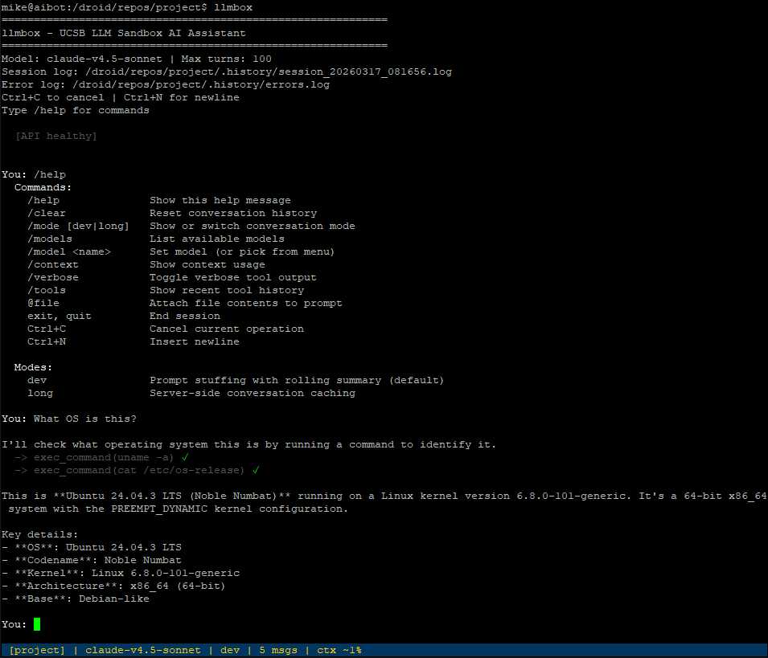

# llmbox-cli

An AI assistant CLI for the UCSB LLM Sandbox.



## Setup

```bash
git clone https://github.com/mblakemore/llmbox-cli.git
cd llmbox-cli
./setup.sh
```

The setup script will:
1. Install Python dependencies (`requests`, `markdownify`, `PyMuPDF`, `prompt_toolkit`)
2. Add the `llmbox` command to your PATH
3. Prompt for your API URL and key (saved to your shell profile)

Then start it from any directory:

```bash
llmbox
```

### Manual setup

If you prefer to set things up yourself:

```bash
pip install requests markdownify PyMuPDF prompt_toolkit
export BEDROCK_API_URL="https://your-api-gateway-url"
export BEDROCK_API_KEY="your-api-key"
python llmbox.py
```

## Usage

```bash
# Interactive mode
llmbox

# Single prompt (auto mode — runs and exits)
llmbox -a "analyze the codebase and suggest improvements"

# Continue from last checkpoint
llmbox -c

# Override the model
llmbox -m claude-v4.5-opus "your prompt"

# Use long mode (server-side conversation caching)
llmbox --mode long
llmbox --mode long -a "research this topic in depth"
```

### Running with Python directly

```bash
python llmbox.py
python llmbox.py -a "your prompt"
python llmbox.py -c
python llmbox.py -m claude-v4.5-opus "your prompt"
python llmbox.py --mode long "your prompt"
```

### Interactive commands

| Command | Description |
|---------|-------------|
| `/help` | Show available commands |
| `/clear` | Reset conversation history |
| `/mode [dev\|long]` | Show or switch conversation mode |
| `/models` | List available models from the gateway |
| `/model <name>` | Set the model (or pick from a menu if no name given) |
| `/context` | Show context usage with progress bar |
| `/verbose` | Toggle verbose tool output |
| `/tools` | Show recent tool call history |
| `@path/to/file` | Attach file contents to your prompt |
| `exit`, `quit` | End the session |

### Keyboard shortcuts

| Key | Description |
|-----|-------------|
| **Enter** | Submit prompt |
| **Ctrl+N** | Insert newline (multiline input) |
| **Ctrl+C** | Cancel current operation |
| **Tab** | Autocomplete (`/` commands, `@` file paths) |

When `prompt_toolkit` is not installed, the TUI falls back to basic `input()` with double-escape cancellation.

### Agent identity

Place an `agent.md` file in the working directory to provide the agent with persistent identity and instructions. It is automatically loaded at the start of each session.

## Built-in tools

| Tool | Description |
|------|-------------|
| `file` | Read, write, append, delete, and list files. Enforces read-before-write. |
| `exec_command` | Run shell commands with timeout, background execution, and session management. |
| `search_files` | Regex search across files (like grep). |
| `web_fetch` | Fetch web pages, convert to markdown, save to `.llmbox/state/fetched/`. |
| `think` | Separate reasoning API call with chain-of-thought enabled. |
| `task_tracker` | Persistent task management stored in `.llmbox/state/tasks.json`. |
| `read_pdf` | Extract text from PDF files with page range support. |
| `sleep` | Pause execution for a specified duration. |

## Custom tools

Add tool modules to a `tools/` directory in the working directory. Each module should export:

- `fn` — the callable implementation
- `definition` — an OpenAI-compatible tool schema dict

Custom tools with the same name as built-in tools will override them.

## Conversation modes

The agent supports two conversation modes, selectable via `--mode` or `/mode`:

| | **dev** (default) | **long** |
|---|---|---|
| Context strategy | Client-side prompt stuffing with rolling summarization | Server-side conversation caching |
| Best for | Development workflows, agentic tool use, code generation | Extended Q&A, research, brainstorming |
| Max session length | Unlimited (summary compresses indefinitely) | Bounded by model context window |

**dev mode** rebuilds the full prompt each turn from recent history and a rolling summary. Old messages are automatically summarized and pruned. Best for tool-heavy workflows.

**long mode** uses the server's conversation memory. The server retains all messages exactly, giving perfect recall of earlier turns. When the context window fills up, it recovers by summarizing and starting a new conversation (or switching to dev mode).

Switch modes mid-session with `/mode dev` or `/mode long`. Use `/mode` to see current stats.

## Claude Code gateway

`cc_gateway.py` is a local proxy that lets [Claude Code](https://docs.anthropic.com/en/docs/claude-code) use Sandbox-hosted models by translating the Anthropic Messages API into Sandbox Bot API calls. See [docs/cc_gateway.md](docs/cc_gateway.md) for setup instructions.

```bash
# Start the gateway
uvicorn cc_gateway:app --port 8781

# Point Claude Code at it
export ANTHROPIC_BASE_URL=http://localhost:8781
export ANTHROPIC_API_KEY=not-needed
```

## Library usage

`llmbox_lib` provides an `Agent` class for using the agent programmatically without terminal I/O. See [docs/library.md](docs/library.md) for API details and examples.